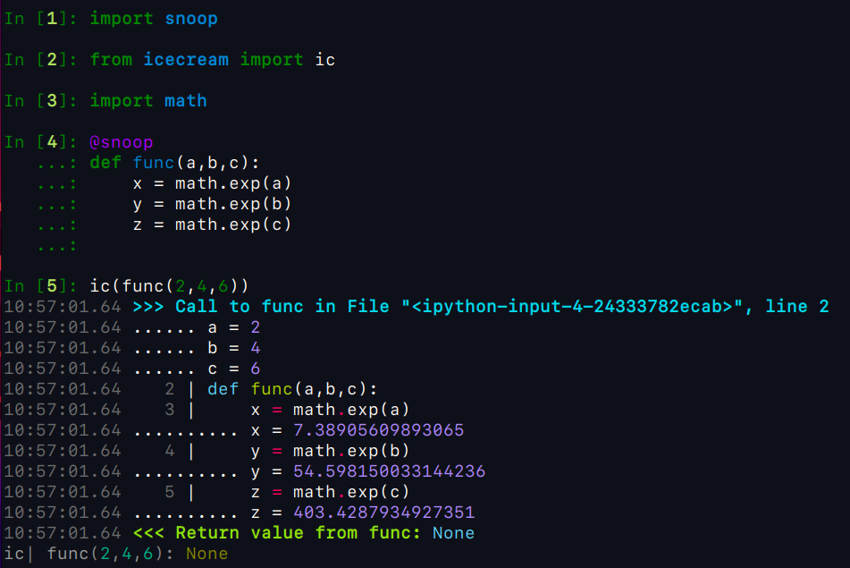
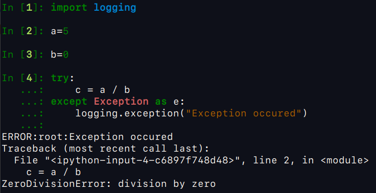

## 3 Powerful tools to improve your skills in debugging code in python

It's time to improve your **HARD SKILLS**

Theses tools will help you to do a better job in debugging and it will make you a better programmer. The following libraries are useful tools to add to your toolbox.

- **icecream**
- **snoop**
- **logging**

In the programming world, the debug skill will allow you to do the job in an efficient way and much faster. 

I will breakdown step-by-step in details the 3 tools for debugging and show ***how to install***, ***how to configure***, and ***how to use***.

let's look what python version is available in your system. In the terminal window type the command:

```bash
$ python --version
Python 3.7.6
```

**NOTE**: For this tutorial you need to use python 3.

We also have pip installed. We use the pip command to install
the python library, if you don't have pip (```pip - A tool for installing and managing Python packages```) installed and python, 
**No problem**, you can see the commands to install then, in my [Github Gist](https://gist.github.com/andvsilva/d57e80dcece8574b21437fada4693dc4).

## Pip to install packages
if you already set everything up, so now we can install the python packages using ```pip```

```bash
# terminal window:
$ pip install icecream
$ pip install snoop
$ pip install logging
```

Now I will show to you the main features of each package:

## 1 - icecream

A good way to see how this package works, let's to use:

```bash
$ ipython

In [1]: import math
In [2]: from icecream import ic

In [3]: ic(math.exp(2.95))                        
ic| math.exp(2.95): 19.10595372823165 # shows variable's name and you value.
Out[3]: 19.10595372823165
```

So, ```icecream``` shows up to be a better than ```print()``` because this package have some features that help to find out what is problem in the code.

## 2 - snoop

This is my favorite package because snoop investigates line-by-line, each iteration in the loop or each variable content and show to us printing on the screen, as shown below:



As you see above, ```snoop``` shows an amazing feature for debugging and is a great acquisition for your toolbox.

## 3 - logging

The logging module in Python is a ready-to-use and powerful module that is designed to meet the needs of beginners as well as enterprise teams. It is used by most of the third-party Python libraries, so you can integrate your log messages with the ones from those libraries to produce a homogeneous log for your application.

Now I will how this package works, as shown below:



```logging``` has many different features that you can use to integrate to your application and get your logs to help you to monitor your jobs. To know more about the features availables, you can read the article on the [real python - logging in python](https://realpython.com/python-logging/).

I hope that these small tips can help you to build a stronger programming skills.

Thank you very much for taking time to read this article, I appreciate.

That's all. I hope you enjoy! To know more about me see my [webpage - andvsilva](https://andsilvadrcc.gitlab.io/my-web-page-andre-vieira/). In the next months I will write more articles about data science, machine learning and programming.

Have a nice day :) see you


```happy coding```