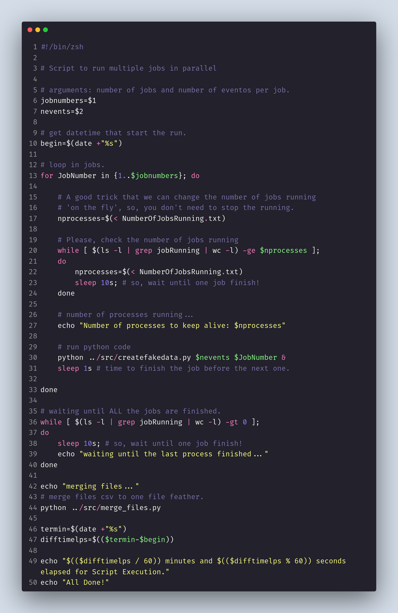
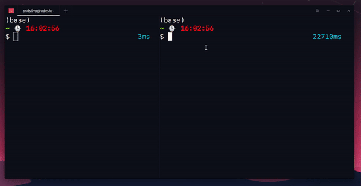
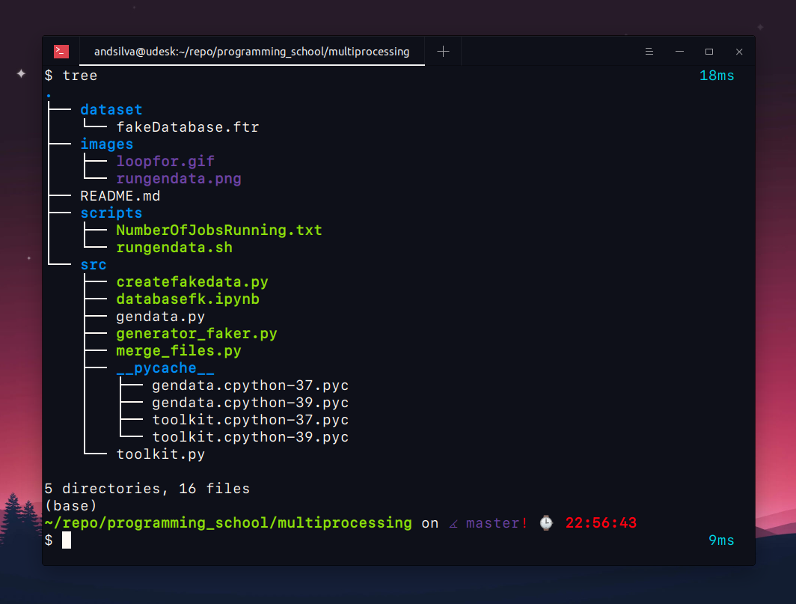
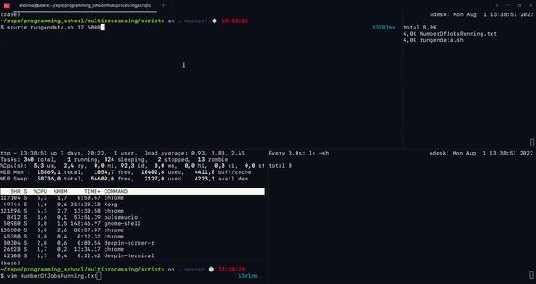
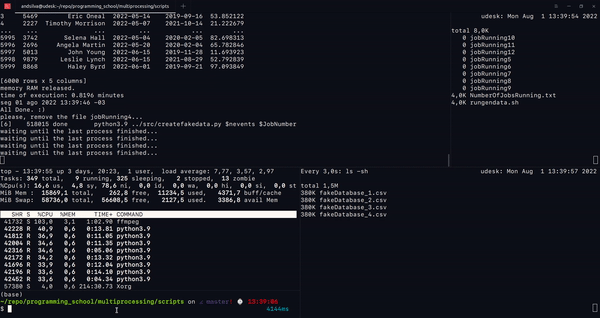

## A Simple Bash Script to Run in Parallel Python Scripts

#### A powerful script that will change the way automate your tasks.

In this article, I will show you how to write a simple bash script that will run multiprocessing python scripts, theses python scripts executes a tasks and you can change the tasks according with you goals. In the bash script has a simple trick to control the number of jobs running in parallel in the moment.

#### Who this article is for?

This article is for everyone, the beginners and developers. 

### What you learn in this tutorial?

I will try to explain how you can write a simple bash script that will run multiple tasks in parallel, the tutorial will allow you to learn a method to run multiprocessing, bash script tricks and python package to generate fake data (read this to know more [https://andsilvadrcc.medium.com/how-to-generate-fake-data-using-the-faker-python-package-b6734b944cb2])

I will use basic commands - **Bash Script** and **Python**, if you are not familiar with the commands, I will try to explain in details (you can to study the basics commands before to read this article). 

## Which Shell and Python you have installed?

First, let's check which ```$SHELL environment``` and ```python --version``` are available in your OS. To check you need to open the terminal window and type the command:

```bash
#### Terminal Window.
$ which $SHELL
/usr/bin/zsh

# probably will see the bash
# and this script also will work in bash.
$ python --version
Python 3.9.10
```

**NOTE**: **For this tutorial you need to use python 3.**

Now, I will start to describe line-by-line the bash script to run the python scripts in parallel with the one trick to control the number of jobs running, this is a great method when you are running your jobs in a cluster, because you can reduce or increase the number of jobs running.

### The source code in bash script:

I wrote the code bash script called [rungendata.sh][https://gist.github.com/andvsilva/fbea32d63a9c26bc287282b7a5fdda0b]. Below I will explain line-by-line the bash script.



#### Line 1:  ```#!/bin/zsh```: 
Execute the file using zsh, the Z shell, or a compatible shell.

#### Difference Between Zsh and Bash - https://www.educba.com/zsh-vs-bash/
- Zsh is called Z Shell, which is an extension of Bash that has many new features and themes. Zsh was released in 1990 by Paul Falstad. Zsh has similarities with Korn shell as well. Linux and Mac OS use Bash as their default shell.

- Bash is the abbreviation of the Bourne-again shell. In 1971, the UNIX operating system was released along with the Thompson shell. In 1979, the Thompson shell was modified and released as a Bourne shell. Brian Fox released Bash in 1989 for his project that provided improvements from its previous versions. Bash release enhanced its use as a scripting language. The default Zsh is different from Bash.

- **Key Differences Between Zsh and Bash**
    - Let us discuss some of the major key differences:
        - Zsh is more interactive and customizable than Bash.
        - Zsh has floating-point support that Bash does not possess.
        - Hash data structures are supported in Zsh that are not present in Bash.
        - The invocation features in Bash is better when comparing with Zsh.
        - The prompt look can be controlled in Bash, whereas Zsh is customizable.

For run this script, you should pass the following arguments to the bash script, as ```the number of jobs``` to run and ```the number of events``` for each job.

#### Line 5: Argument: ```jobnumbers=$1``` 
#### Line 6: Argument: ```nevents=$2```

The arguments are passed to the script, as shown below:

```bash
## `source` is a shell built-in command which is used
## to read and execute the content of a file.

# source rungendata.sh jobnumbers nevents 
$ source rungendata.sh 10 1000

# when you pass the arguments, they are in a numerical
# order, e.g., $1, $2, $3...
# `$number` is a way to get the argument inside the script.
```

The script has a way to calculate the execution time.

#### Line 10: ```begin=$(date +"%s")```

We get the timestamp for the moment that the script start to run, the beginning. For example, in the terminal:

```bash
# command `man` - manual to access information about the command.
$  man date
# date - print or set the system date and time

# e.g.:
$ date
sex 29 jul 2022 15:30:15 -03

# get date and convert to timestamp:
$ begin=$(date +"%s")

# print variable begin
$ echo $begin
1659119415 # timestamp

# convert timestamp to date:
$ date -d @1659119415 '+%Y-%m-%d %H:%M:%S'
2022-07-29 15:30:15
```

#### Line 13: loop ```for```:

One loop ```for``` to run the jobs, where has a number of events. Below a small explanation how to works the loop ```for```:

```bash

#variables:
start=0
end=10

# loop
for i in {$start..$end}; do
    ## do something...
    echo $i
done
```

Let's run one example:



#### Line 17:  ```nprocesses=$(< NumberOfJobsRunning.txt)```

In the script, this line get the number of jobs running in the file. The file store the number of jobs running, i.e., when the script is running, you can change the number of jobs running `on the fly`. And the number is passed to the variable ```nprocesses```. This method is very powerful when you are running your jobs in a cluster and you need to reduce or increase the number of jobs running.

But, **How actually this method really works?**

We use the ```touch``` command to create an empty file. The empty file is just a reference to job running, e.g., jobRunning1 jobRunning2 ... 

```bash
## jobNumber is reference to the job.
touch jobsrunning/jobRunning{jobNumber}
```

While the job is running, the script check if the job is finished by the block of code:

```bash
# Please, check the number of jobs running
while [ $(ls -l | grep jobRunning | wc -l) -ge $nprocesses ]; 
do
    nprocesses=$(< NumberOfJobsRunning.txt)
    sleep 10s; # so, wait until one job finish!
done
```

Let's break down piece by piece the block of code, to see how they work, the ```while``` loop is used to check constantly if there are the ```jobRunning$jobNumber``` file(s) in the directory. So, the condition in the ```while``` loop, the ```ls``` command return a list of files in the directory that is passed by ```|``` (pipe) - The Pipe is a command in Linux that lets you use two or more commands such that output of one command serves as input to the next. The output is passed to the ```grep``` command that get the file with the name (```jobRunning```) and pass to the ```wc``` command allows you to count the number of lines, words, characters, and bytes of each given file or standard input and print the result. If the number of files (```jobRunning```) are greater or equal to the number of processes running ```nprocesses``` do ```sleep 10s``` command to wait for 10 seconds, i.e. the condition is ```True``` so ```do```...```done```, by the contrary case, the script launch one more job until the condition is satisfied. e.g.,

the ```ls -l``` command
```bash
$ ls -l                                                                                                                  4ms 
total 0
-rw-rw-r-- 1 user 0 jul 29 17:35 jobRunning1
-rw-rw-r-- 1 user 0 jul 29 17:35 jobRunning2
-rw-rw-r-- 1 user 0 jul 29 17:35 jobRunning3
-rw-rw-r-- 1 user 0 jul 29 17:35 jobRunning4
```

with the ```grep``` command

```bash
$ ls -l | grep jobRunning # highlight the files with the name `jobRunning`
```

and the ```wc -l``` command to count the number of files.

```bash
$ ls -l | grep jobRunning | wc -l
4
```

#### Line 30: Run the ```python``` script

The python script is called ```createfakedata.py``` to create fake data(to know more about this script, you can check my article on the medium), but this can be change to anything else, to execute another task. I will describe a little about the python script in the end, but first I will finish the explanation of the bash script.

When one job is finished, the file ```jobRunning$jobNumber``` is remove by the ```rm``` command:

```bash
rm jobsrunning/jobRunning{jobNumber}
```

#### Line 36-40: the block of code

When ALL the jobs are finished, we check this using the following block of code:

```bash
# waiting until ALL the jobs are finished.
while [ $(ls -l | grep jobRunning | wc -l) -gt 0 ]; 
do
    sleep 10s; # so, wait until one job finish!
    echo "waiting until the last process finished..."
done
```

The script ```createfakedata.py``` is a generator to create fake data using a python package called **Faker**, the outputs are CSV files, where each file is generated in each job, so, as final output, we want to merge ALL the files to only one CSV file. For this task, we use the script in python to do the merge. ```Line 44: python ../src/merge_files.py```

Almost there, If you read until here, you already learn a lot! Congratulations! 

#### Line 46: ```termin=$(date +"%s")```

We get the timestamp that the script finish.

#### Line 47: Difference between Start and End

```bash
difftimelps=$(($termin-$begin))
```

#### Line 49: Convert timestamp to minutes and seconds

```bash
echo "$(($difftimelps / 60)) minutes and $(($difftimelps % 60)) seconds elapsed for Script Execution."
```

### How the directories are organized:



### Now is time to show how this script works. Let's go! :)

To run this script you just need to open the terminal and go to the directory ```scripts``` and type the command - ```source rungendata.sh 10 1000``` i.e. 10 jobs and 1000 events. The script will run the python script ```createfakedata.py``` that will generate 1000 events and return a dataframe containing the fake data for each job, in CSV file format, in the end the python script ```merge_files.py``` will merge the files in to one simple file in ```feather-format```.

Below two gifs showing whole process to run the jobs:


##### Running jobs

The terminal window is split into four parts, the first part (**top-left corner**), the command ```source rungendata.sh 12 6000``` and (**top-right corner**) the jobRunning files with the respective job Number. On the (**bottom-left corner**) the ```top``` command shows python running in parallel, more below I change the number of job running on the file ```NumberOfJobsRunning.txt``` (from 4 jobs to 8 jobs). The script detect the change and increase the number of jobs alive.



####To Finish 

After the jobs are finished, the script will run the python script ```merge_files.py``` to merge the CSV files in to one file challed ```fakeDatabase.ftr``` format-format, see (**bottom-right corner**)



That's it for today. I hope you enjoy! If you like it, follow me and comment or make a suggestions below. Thank you very much for read the article, I appreciate.


